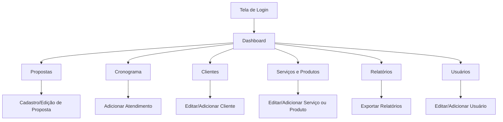

# Projeto de Interface - TecSolutions

## 📘 Visão Geral

Documentação das telas e fluxos de interface do sistema **TecSolutions**, uma plataforma para gerenciamento de propostas comerciais, cronogramas de atendimento, clientes, serviços, produtos e relatórios.

---

## 🖥️ Telas do Sistema

### 1. Tela Home (Site Institucional)

**Descrição:**

- Página inicial com informações da empresa
- Links para "Sobre", "Serviços" e "Contato"
- Botão de acesso ao sistema

---

### 2. Tela de Login

**Descrição:**

- Campos para e-mail e senha
- Botão "Entrar"
- Link para "Esqueci minha senha"
- Link para "Cadastrar-se" (quando permitido)

---

### 3. Tela de Cadastro

**Descrição:**

- Campos para nome completo, e-mail, senha e confirmação de senha
- Botão "Criar conta"
- Link para login

---

### 4. Dashboard (Painel Principal)

**Elementos:**

- Menu lateral com navegação (Propostas, Cronograma, Clientes, Serviços, Produtos, Relatórios, Usuários)
- Painéis com resumo (propostas recentes, atendimentos agendados, clientes ativos)
- Indicadores visuais e gráficos

---

### 5. Tela de Propostas

**Funcionalidades:**

- Cadastro de propostas com serviços e valores
- Cálculo automático do valor total
- Status da proposta (Em análise, Aprovada, Rejeitada)
- Exportação em PDF
- Histórico de alterações

---

### 6. Tela de Cronograma

**Elementos:**

- Visualização em lista ou calendário
- Filtro por cliente, serviço e status
- Botão "Adicionar atendimento"
- Edição e reatribuição de atendimentos

---

### 7. Tela de Gestão de Clientes

**Funcionalidades:**

- Listagem de clientes com informações de contato e histórico
- Criação e edição de clientes
- Importação via planilha (.csv)

---

### 8. Tela de Serviços e Produtos

**Funcionalidades:**

- Cadastro de serviços e produtos com descrição e valor
- Organização por categorias
- Edição e exclusão

---

### 9. Tela de Relatórios

**Funcionalidades:**

- Relatórios financeiros e operacionais por período
- Indicadores de produtividade
- Exportação em PDF e Excel

---

### 10. Tela de Gestão de Usuários

**Funcionalidades:**

- Listagem de usuários com nome, e-mail e tipo (admin ou comum)
- Ações de ativar, desativar e editar
- Criação manual de usuários
- Importação via planilha (.csv)

---

## 🔁 Fluxo de Navegação

